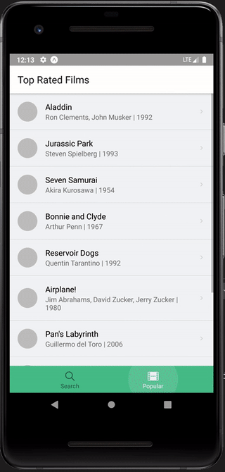
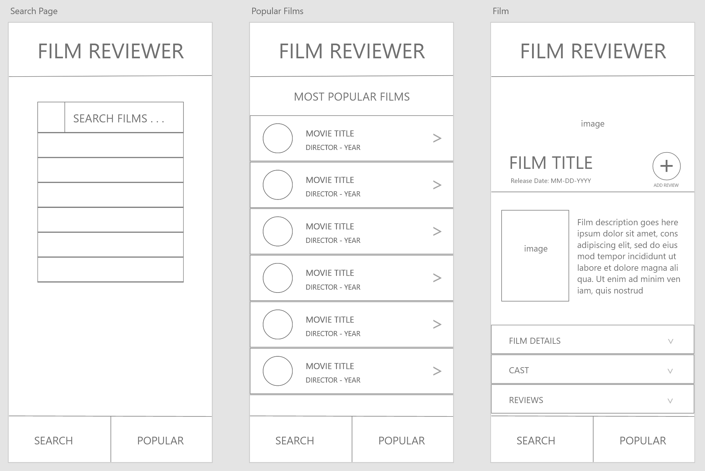

# Film Reviewer

## Overview

This is a React Native application which uses data from the IMDB API to allow users to search through the IMDB film catalogue, view film information, scroll through top rated films from various genres, and add comments for popular films.

## Tech Used

This application was built in React Native along with the Expo CLI. It utilizes a number of third-party libraries and APIs for added functionality

- react-native-animatable for animation effects
- react-native-snap-carousel to create scrolling carousels
- react-navigation for stack navigator and tab navigation
- react-native-elements for additional components
- OMDb API for fetching movie data

## Wireframe and Design

Here is the inital design wireframe along with the final results

## Contact Me

If you have any questions, concerns, or comments please contact me at wandrew8@gmail.com. You can check out more of my work [here](http://www.andrewjohnweiss.com).
